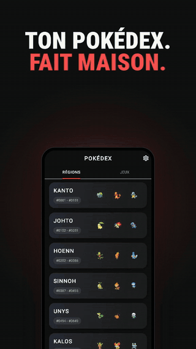
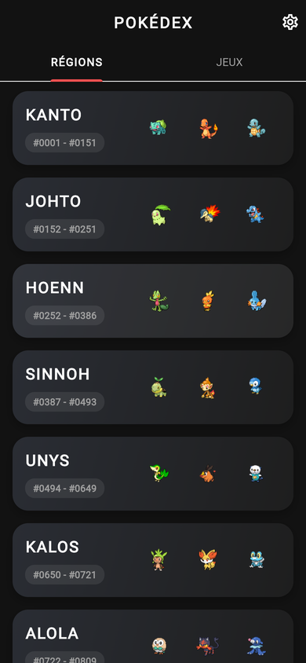
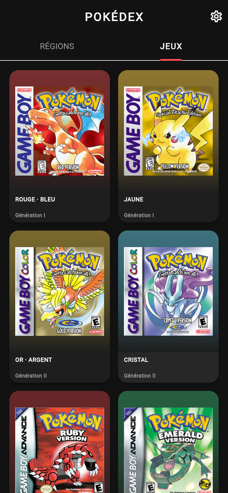
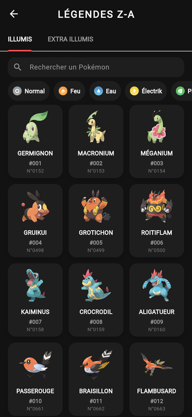
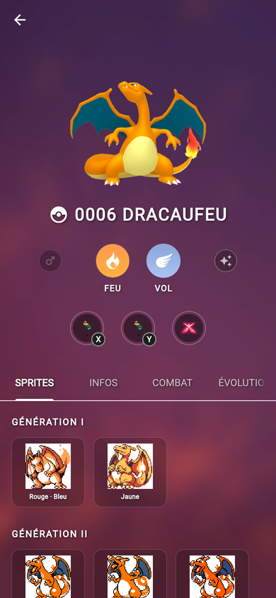
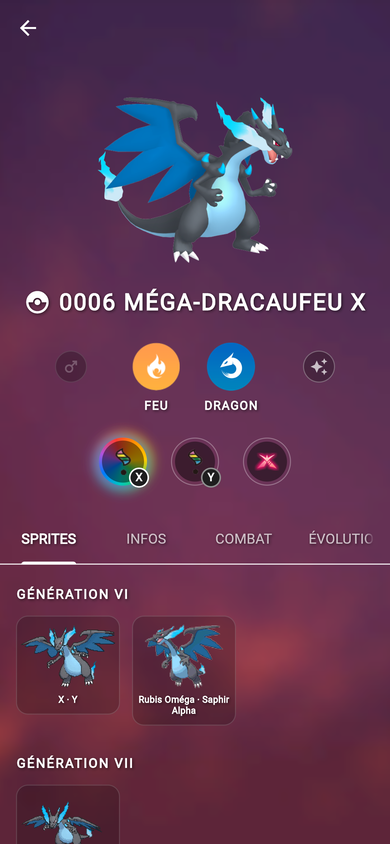
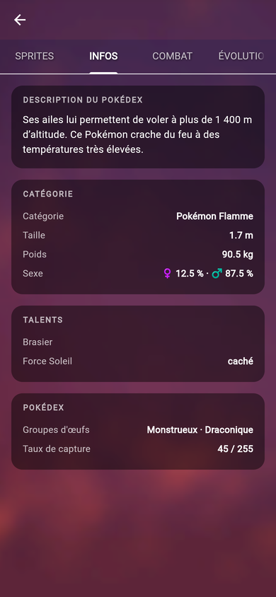
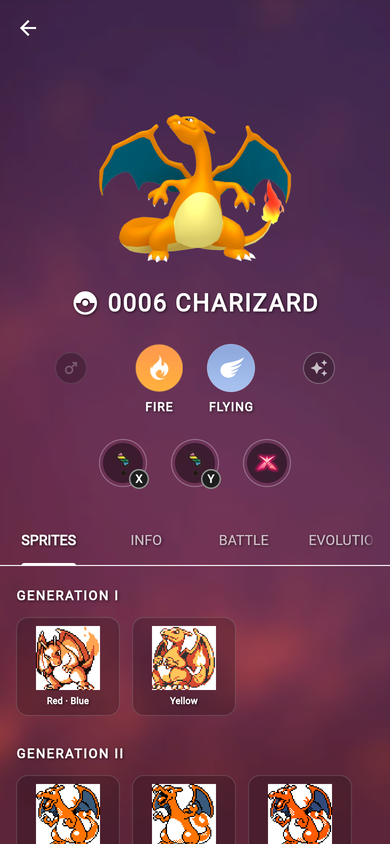
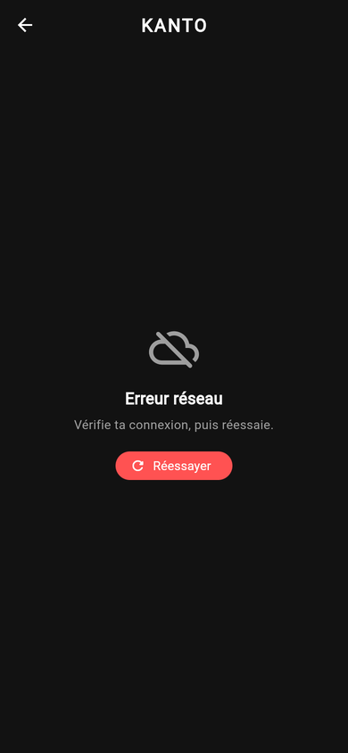
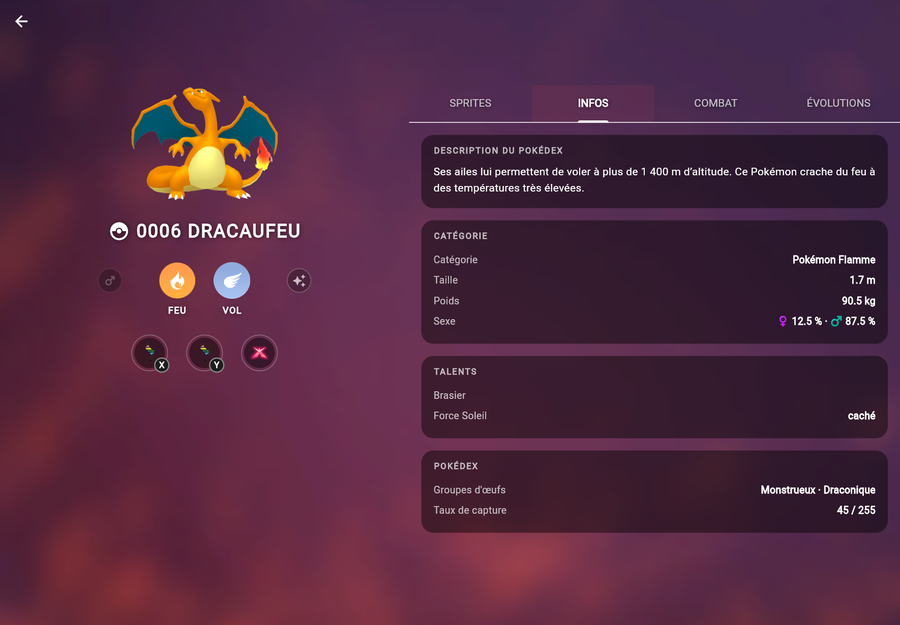

<div align="center">


# Pokédex

**Un Pokédex fait maison, en Flutter, pour Android et iPhone.**
Choisis un jeu, parcours son Pokédex, ouvre la fiche de n'importe quel Pokémon.
En français et en anglais.

[**⬇️ Télécharger la dernière version**](https://github.com/Mat8313/pokedex-flutter/releases/latest)



</div>

---

## Ce que fait l'application

- **Par région ou par jeu** — de Rouge · Bleu à Légendes Z-A, chaque jeu a son propre Pokédex,
  avec ses Pokédex régionaux (Paldea, Septentria, Myrtille…) et le National quand il existe.
- **Formes alternatives** — les formes régionales (Tauros de Paldéa, Raichu d'Alola…) apparaissent
  dans les jeux où elles existent ; Méga-Évolutions et formes Gigamax sont sur la fiche.
- **Fiche complète** — sprites de chaque génération (normaux, chromatiques, femelles), types,
  description, taille, poids, talents, groupes d'œufs, table des faiblesses, chaîne d'évolution
  avec ses conditions.
- **Recherche et filtres** par nom et par type.
- **Français et anglais**, thème sombre ou clair, sprite chromatique par défaut au choix.
- **Hors ligne** — tout ce qui a déjà été consulté reste disponible sans réseau.
- **Tablette** — la fiche passe sur deux colonnes.

<div align="center">













</div>

## Installer

Les fichiers sont sur la page [**Releases**](https://github.com/Mat8313/pokedex-flutter/releases/latest).

### Android

1. Sur le téléphone, télécharger `pokedex-vX.Y.Z.apk`.
2. L'ouvrir. Android demande d'autoriser l'installation depuis le navigateur ou le gestionnaire
   de fichiers : l'accepter pour cette source.
3. C'est tout. Les versions suivantes s'installent par-dessus.

### iPhone et iPad

L'`.ipa` n'est pas signée (la signer pour tout le monde demande un compte développeur Apple
payant). Un outil de *sideloading* la signe sur place avec **votre** identifiant Apple :

- [**AltStore**](https://altstore.io) ou [**SideStore**](https://sidestore.io) — installer
  l'outil une fois, puis ouvrir `pokedex-vX.Y.Z.ipa` avec lui depuis l'iPhone.
- [**Sideloadly**](https://sideloadly.io) — depuis un PC ou un Mac, iPhone branché en USB :
  glisser l'`.ipa` dans la fenêtre et entrer son identifiant Apple.

Avec un identifiant Apple gratuit, l'application est à re-signer **tous les 7 jours** (AltStore
et SideStore le font tout seuls tant qu'ils tournent). Il faut aussi activer le *Mode
développeur* dans Réglages → Confidentialité et sécurité.

## Compiler soi-même

Il faut [Flutter](https://docs.flutter.dev/get-started/install) (canal stable).

```bash
git clone https://github.com/Mat8313/pokedex-flutter.git
cd pokedex-flutter
flutter pub get
flutter run
```

```bash
flutter test                      # tests unitaires
flutter test integration_test     # parcours complet, sur un appareil branché
flutter build apk --release       # APK Android
```

## Publier une version

Pousser un tag de version déclenche le workflow [`release.yml`](.github/workflows/release.yml) :
il compile l'APK sur Linux et l'IPA sur macOS, puis crée la Release avec les deux fichiers.

```bash
git tag v1.0.0
git push origin v1.0.0
```

**Signature Android (recommandé).** Sans clé, chaque APK est signé avec une clé jetable
différente, et une nouvelle version ne peut pas remplacer l'ancienne sans désinstallation.
Créer la clé une fois (voir [`docs/2026-09-25-pret-pour-mobile.md`](docs/2026-09-25-pret-pour-mobile.md)),
puis l'ajouter dans *Settings → Secrets and variables → Actions* :

| Secret | Valeur |
|---|---|
| `ANDROID_KEYSTORE_BASE64` | le fichier `.jks` encodé en base64 |
| `ANDROID_KEYSTORE_PASSWORD` | le mot de passe du keystore |
| `ANDROID_KEY_ALIAS` | l'alias de la clé (`pokedex`) |
| `ANDROID_KEY_PASSWORD` | le mot de passe de la clé |

Pour obtenir le base64 sous Windows :

```powershell
[Convert]::ToBase64String([IO.File]::ReadAllBytes("$env:USERPROFILE\pokedex-release.jks")) | Set-Clipboard
```

## Sous le capot

- **Flutter** / Dart, Material 3, sans framework d'état : `setState`, `FutureBuilder` et un
  `ChangeNotifier` pour les réglages.
- Données : [PokéAPI](https://pokeapi.co). Les noms traduits (espèces, talents, objets, formes)
  sont extraits hors ligne de ses fichiers CSV et embarqués dans `assets/i18n/`, pour qu'une
  grille de 400 Pokémon s'affiche traduite sans 400 requêtes.
- Cache : réponses de l'API gardées en mémoire et sur le disque (`lib/services/api_cache.dart`),
  images via `cached_network_image`.
- Traductions de l'interface : fichiers `.arb` dans `lib/l10n/`.

## Crédits

- Données et sprites : [PokéAPI](https://pokeapi.co) et [PokeAPI/sprites](https://github.com/PokeAPI/sprites).
- Projet personnel d'étudiant, sans but commercial et **sans lien avec Nintendo, Game Freak ou
  The Pokémon Company**. Pokémon et les noms associés sont des marques de leurs détenteurs.

---

<details>
<summary><b>English</b></summary>

A homemade Pokédex built with Flutter for Android and iOS: browse by region or by game (Red ·
Blue to Legends: Z-A, with each game's own regional dexes and alternate forms), open a full
entry for any Pokémon (sprites from every generation, types, abilities, egg groups, weaknesses,
evolution chain), in English or French, with offline caching and a tablet layout.

**Install:** grab the `.apk` (Android) or the unsigned `.ipa` (iOS, via AltStore, SideStore or
Sideloadly) from the [latest release](https://github.com/Mat8313/pokedex-flutter/releases/latest).
**Build:** `flutter pub get && flutter run`.

A personal student project, not affiliated with Nintendo, Game Freak or The Pokémon Company.

</details>
